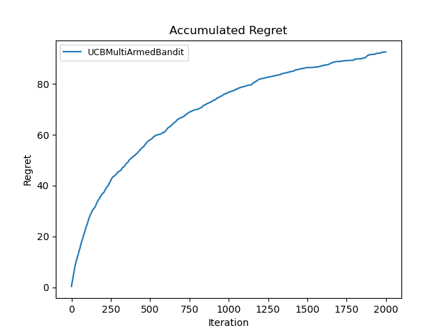
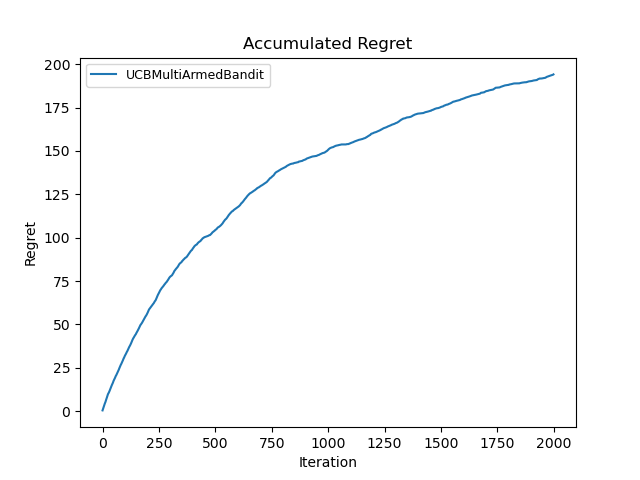
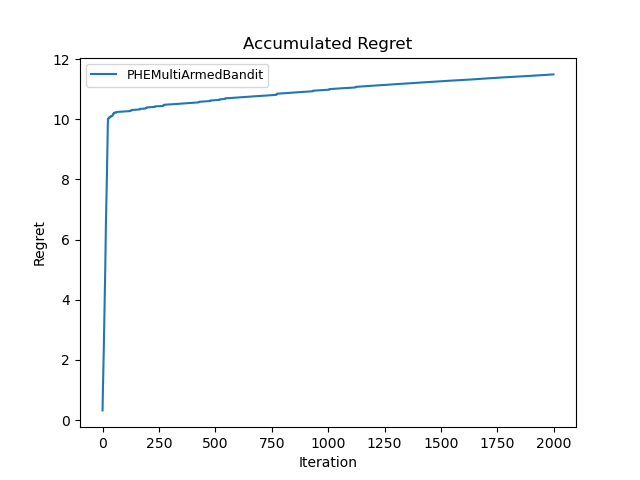
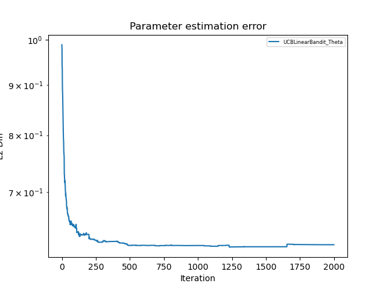
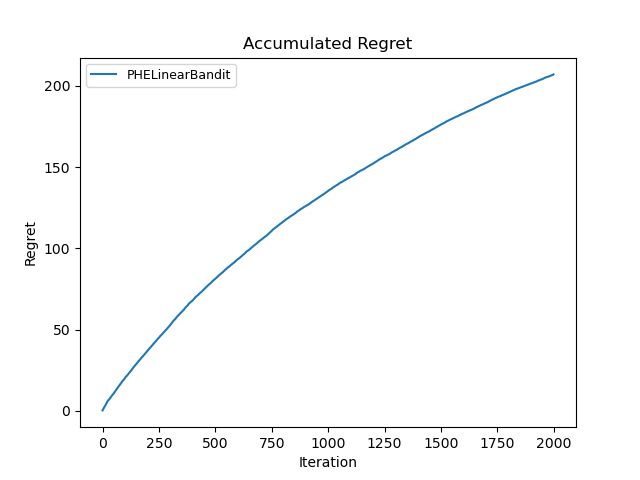
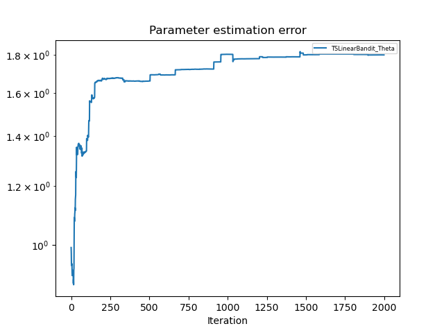

> 刘雅迪
> 计26
> 学号：2021010521

# MP #1 - Bandit Algorithms

## Part 1: Multi-armed Bandit Problem
### 1. the algorithms
#### 1.1 Upper Confidence Bound
inputs: 
- num_arms: the number of arms(the articles) in the bandit problem (可以调整)
- pool_articles: the articles for the selection
- userID: the user's id
- click: the binary value indicating whether the user clicked the article
- NoiseScale: the noise scale (可以调整)

steps:
- initialize the parameters
- for each round:
  - select the arm with the highest UCB score 
    - (note that if the arm is never been selected, explore it compulsively)
  - update the parameters

equations:
$$UCB score = mean + \sigma * sqrt(2 * log(t) / N)$$

arm_selection:
```
def decide(self, pool_articles):
    maxUCB = float('-inf')
    articlePicked = None

    for article in pool_articles:
        article_id = article.id
        
        # # 如果该臂从未被选中，强制探索
        if self.UserArmTrials[article_id] == 0:
            return article
        
        ucb = self.UserArmMean[article_id] + self.sigma * np.sqrt((2*np.log(self.time + 1)) / self.UserArmTrials[article_id])
        if ucb > maxUCB:
            articlePicked = article
            maxUCB = ucb

    return articlePicked
```

parameter update step:
```
def updateParameters(self, articlePicked_id, click):
    self.UserArmMean[articlePicked_id] = (self.UserArmMean[articlePicked_id]*self.UserArmTrials[articlePicked_id] + click) / (self.UserArmTrials[articlePicked_id]+1)
    self.UserArmTrials[articlePicked_id] += 1
    self.time += 1
```

#### 1.2 Thompson Sampling
inputs:
- num_arms: the number of arms(the articles) in the bandit problem (可以调整)
- pool_articles: the articles for the selection
- userID: the user's id
- click: the binary value indicating whether the user clicked the article
- NoiseScale: the noise scale (可以调整)

steps:
- initialize the parameters
- for each round:
  - sample from the posterior distribution of each arm
  - select the arm with the highest sample value
  - update the parameters

equations:
在实验中假设臂i的reward均值$u_i$的先验分布为正态分布，即$N(\mu_{i, 0}, \tau^2_{i, 0}) = N(0, 1)$
在对臂i做一次观测后，其后验分布为$N(\mu_{i, n_i}, \tau^2_{i, n_i})$，则具体的计算公式：
$$\mu_{i, n_i} = \frac{1}{\frac{1}{\tau^2_{i, 0}} + \frac{n_i}{\sigma^2_0}}(\frac{\mu_{i,0}}{\tau^2_{i, 0}}+\frac{\sum_{j=1}^{n_i}r_{i, j}}{\sigma^2}) = \frac{\sum_{j=1}^{n_i}r_{i, j}}{\sigma^2_0 + n_i}$$
$$\frac{1}{\tau^2_{i, n_i}} = \frac{1}{\tau^2_{i, 0}} + \frac{n_i}{\sigma^2} = \frac{\sigma^2}{\sigma^2 + n_i}$$

arm_selection:
```
def decide(self, pool_articles):
    maxTS = float('-inf')
    articlePicked = None

    for article in pool_articles:
        article_id = article.id
        
        sample = np.random.normal(self.UserArmMean[article_id], np.sqrt(self.UserArmVariance[article_id]))
        # print(sample)
        if sample > maxTS:
            articlePicked = article
            maxTS = sample
    # print(articlePicked.id)
    return articlePicked
```

parameter update step:
```
def updateParameters(self, articlePicked_id, click):
    self.UserArmTrials[articlePicked_id] += 1
    old_mean = self.UserArmMean[articlePicked_id]
    self.UserArmMean[articlePicked_id] = (old_mean * (self.sigma2 + self.UserArmTrials[articlePicked_id] - 1) + click) / (self.sigma2 + self.UserArmTrials[articlePicked_id])
    self.UserArmVariance[articlePicked_id] = self.sigma2 / (self.sigma2 + self.UserArmTrials[articlePicked_id]) * self.UserArmMean[articlePicked_id]

    self.time += 1
```

#### 1.3 Perturbed-history Exploration
inputs:
- num_arms: the number of arms(the articles) in the bandit problem (可以调整)
- pool_articles: the articles for the selection
- userID: the user's id
- click: the binary value indicating whether the user clicked the article
- alpha: the perturbation scale, an tunable parameter (可以调整)

steps:
- initialize the parameters
- for each round:
  - calculate the pseudo_rewards and the noise for each article and get the perturbed_mean 
  - select the arm with the highest perturbed_mean 
  - update the parameters

equations:
s记录了每个臂被选中的次数。
$V_{i, s}$ is the cumulative reward of arm i after s pulls
$U_{i, s} \sim B(as, 0.5)$
the mean reward of arm i is: $\mu_{i, t} = \frac{V_{i, s} + U_{i, s}}{(a+1)s}$, 即decide函数中计算的perturbed_mean

arm_selection:
```
def decide(self, pool_articles):
    maxPHE = float('-inf')
    articlePicked = None

    for article in pool_articles:
        article_id = article.id
        
        if self.UserArmTrials[article_id] > 0:
            s = self.UserArmTrials[article_id]
            pseudo_rewards = np.sum(np.random.binomial(int(self.alpha * s), 0.5))
            perturbed_mean = (self.V[article_id] + pseudo_rewards) / (s * self.alpha + s)
        else:
            perturbed_mean = float('inf')
            
        if perturbed_mean > maxPHE:
            articlePicked = article
            maxPHE = perturbed_mean

    return articlePicked
```

parameter update step:
```
def updateParameters(self, articlePicked_id, click):
    self.UserArmMean[articlePicked_id] = (self.UserArmMean[articlePicked_id]*self.UserArmTrials[articlePicked_id] + click) / (self.UserArmTrials[articlePicked_id]+1)
    self.UserArmTrials[articlePicked_id] += 1
    self.V[articlePicked_id] += click
    
    self.time += 1
```


### 2. the plots and findings
在本实验中超参数的初始设置为：
testing_iterations = 2000
NoiseScale = 0.1
n_articles = 25
n_users = 10
UCB算法和TS算法的NoiseScale参数初始设置为0.1， PHE算法的alpha参数初始设置为1.
在初始超参数的设置下，三种算法的regret积累曲线如下：
<div style="display: flex;">
    
    
</div>
<div style="display: flex;">
    
    
</div>

可以看到在初始超参数的设置下TS算法效果最好。

#### 2.1 对k进行调整
1. UCB
保持初始超参数不变，对k(n_articles)进行调整。
从左到右依次是k = 5, 25, 50的情况：
<div style="display: flex;">
    
    
    
</div>

当k值变大时，UCB算法的regret积累曲线的上界会变大，算法的性能下降。

2. TS
保持初始超参数不变，对k(n_articles)进行调整。
从左到右依次是k = 5, 25, 50的情况：
<div style="display: flex;">
    
    
    
</div>

当k值变大时，TS算法的regret积累曲线的上界会变大，算法的性能下降。

3. PHE
保持初始超参数不变，对k(n_articles)进行调整。
从左到右依次是k = 5, 25, 50的情况：
<div style="display: flex;">
    
    
    
</div>

当k值变大时，PHE算法的regret积累曲线的上界会变大，算法的性能下降。

4. 当三者位于同一张图上
   从左到右依次是k = 5, 25, 50的情况：
<div style="display: flex;">
    
    
    
</div>

当k值变大时，三种算法的regret积累曲线的上界均会变大，算法的性能下降。且PHE算法所受的影响最大，而TS算法所受的影响最小。

综上所述：
1. 当k值变大时，三种算法的regret积累曲线的上界均会变大，算法的性能下降。可能因为k值的增大使得算法的选择空间增大，每个动作选择一篇文章的期望回报可能更不确定，从而导致更多的探索和较低的利用效率。此外，k值的增大也反映了更大的复杂性和更多潜在的错误选择。
2. 当k值变大时，PHE算法所受的影响最大，而TS算法所受的影响最小。说明TS算法的鲁棒性较强，能更好地应对选择空间的扩大。

#### 2.2 对NoiseScale和alpha进行调整
1. UCB
保持初始超参数不变，对NoiseScale进行调整。
第一排从左到右依次是NoiseScale = 0.05, 0.1, 0.3的情况
第二排从左到右依次是NoiseScale = 0.5, 0.7的情况
<div style="display: flex;">
    
    
    
</div>
<div style="display: flex;">
    
    
</div>

当NoiseScale值变大时，UCB算法的regret积累曲线的上界会变大，算法的性能下降。说明UCB算法适应噪声比较小的情景。

1. TS
保持初始超参数不变，对NoiseScale进行调整。
第一排从左到右依次是NoiseScale = 0.05, 0.1, 0.3的情况
第二排从左到右依次是NoiseScale = 0.5, 0.7的情况
<div style="display: flex;">
    
    
    
</div>
<div style="display: flex;">
    
    
</div>

当NoiseScale值变大时，TS算法的regret积累曲线的上界会变大，算法的性能下降。说明TS算法适应噪声比较小的情景。

1. PHE
保持初始超参数不变，对alpha进行调整。
第一排从左到右依次是alpha = 0.5, 0.7, 1的情况
第二排从左到右依次是alpha = 2, 5, 20的情况
<div style="display: flex;">
    
    
    
</div>
<div style="display: flex;">
    
    
    
</div>

适当地增大噪声或者减小噪声都可能会提高PHE算法的性能，如当alpha从0.7变为1时和alpha从0.7变为0.5时，PHE算法的性能有所提高，前者避免了曲线的不收敛，后者降低了曲线的上界。但是当alpha过大时，PHE算法的性能会下降，如alpha=20时，过大的alpha会导致regret积累曲线不收敛。说明PHE算法对alpha的值比较敏感，需要适当地选择alpha的值。

综上所述：
1. UCB算法和TS算法适应于小噪声情景。
2. PHE算法对噪声比较敏感，需要合理选择alpha的值。


## Part 2: Contextual Linear Bandit Problem
### 1. the algorithms
#### 1.1 LinUCB
inputs:
- dimension: the dimension of the feature vectors (可调整)
- lambda_: regularization parameter
- pool_articles: the articles for the selection
- userID: the user's id
- alpha: the exploration parameter (可调整)

steps:
- initialize the parameters
- for each round:
  - compute the UCB score for each arm
  - select the arm with the highest score
  - update the parameters

equations:
$$A_t = \lambda I + \sum_{(a_i, r_i)∈H_t} x_{a_i}x^T_{a_i}$$
$$b_t = \sum_{(a_i, r_i)∈H_t} r_{a_i} x_{a_i}$$
$$\theta_{t} = A^{-1}_t b_t$$
$$\text{UCB}_t(a) = x^T_a \theta_t + \alpha \sqrt{ x^T_a A_t^{-1} x_a}$$

arm selection:
```
def decide(self, pool_articles):
    maxPTA = float('-inf')
    articlePicked = None

    for article in pool_articles:
        reward = np.dot(self.UserTheta, article.featureVector)
        uncertainty = np.sqrt(np.dot(np.dot((article.featureVector).T, self.AInv), article.featureVector))
        article_pta = reward + self.alpha * uncertainty
        
        if maxPTA < article_pta:
            articlePicked = article
            maxPTA = article_pta

    return articlePicked
```

parameter update step:
```
def updateParameters(self, articlePicked_FeatureVector, click):
    self.A += np.outer(articlePicked_FeatureVector, articlePicked_FeatureVector) #外积，结果是一个矩阵
    self.b += articlePicked_FeatureVector * click # r_t * x, r_t是奖励，x是特征向量
    self.AInv = np.linalg.inv(self.A)
    self.UserTheta = np.dot(self.AInv, self.b)
    self.time += 1
```

#### 1.2 LinTS
inputs:
- dimension: the dimension of the feature vectors (可调整)
- lambda_: regularization parameter
- pool_articles: the articles for the selection
- userID: the user's id
- sigma: the standard deviation of the noise (可调整)

steps:
- initialize the parameters
- for each round:
  - sample from the posterior distribution of each arm
  - select the arm with the highest sample value
  - update the parameters

equations:
$$A_t = \lambda I + \frac{1}{\sigma^2}\sum_{(a_i, r_i)∈H_t} x_{a_i}x^T_{a_i}$$
$$b_t = \frac{1}{\sigma^2}\sum_{(a_i, r_i)∈H_t} r_{a_i} x_{a_i}$$
$$\theta_{t} \sim N(A^{-1}_t b_t, A^{-1}_t)$$
$$r_{a_i} = \theta_{a_i}^T x_{a_i}$$


arm selection:
```
def decide(self, pool_articles):
    maxPTA = float('-inf')
    articlePicked = None

    sample_theta = np.random.multivariate_normal(self.UserTheta, self.lambda_ * self.AInv)
    
    for article in pool_articles:
        article_pta = np.dot(sample_theta, article.featureVector)
        
        if maxPTA < article_pta:
            articlePicked = article
            maxPTA = article_pta

    return articlePicked
```

parameter update step:
```
def updateParameters(self, articlePicked_FeatureVector, click):
    self.A += (1/self.sigma2) * np.outer(articlePicked_FeatureVector, articlePicked_FeatureVector) #外积，结果是一个矩阵
    self.b += (1/self.sigma2) * articlePicked_FeatureVector * click # r_t * x, r_t是奖励，x是特征向量
    self.AInv = np.linalg.inv(self.A)
    self.UserTheta = np.dot(self.AInv, self.b)
    self.time += 1
```

#### 1.3 LinPHE
inputs:
- dimension: the dimension of the feature vectors (可调整)
- lambda_: regularization parameter
- pool_articles: the articles for the selection
- userID: the user's id
- alpha: The perturbation scale (可调整)

steps:
- initialize the parameters
- for each round:
  - generate the noise Z and calculate the estimated reward
  - select the arm with the highest estimated reward
  - update the parameters

equations:
$$A_t = (\alpha + 1)(\lambda I + \sum_{(a_i, r_i)∈H_t} x_{a_i}x^T_{a_i})$$
$$b_t = \sum_{(a_i, r_i)∈H_t} (r_{a_i} + \sum^{\alpha}_{j = 1} Z_{j, t})x_{a_i}$$
其中，$Z \sim Ber(0.5)$是每轮重新生成的
$$\theta_{t} = A^{-1}_t b_t$$
$$estimated\_reward = x^T_i \theta_t$$

arm selection:
```
def decide(self, pool_articles):
    maxPTA = float('-inf')
    articlePicked = None

    for article in pool_articles:
        if article.id not in self.armTrials:
            return article
        
        article_pta = np.dot(self.UserTheta, article.featureVector)
        
        if maxPTA < article_pta:
            articlePicked = article
            maxPTA = article_pta

    return articlePicked
```

parameter update step:
```
def updateParameters(self, articlePicked, click):
    if articlePicked.id not in self.armTrials:
        self.armTrials[articlePicked.id] = 0
        self.armfeatureVector[articlePicked.id] = articlePicked.featureVector
        self.armReward[articlePicked.id] = 0
    self.armTrials[articlePicked.id] += 1
    self.armReward[articlePicked.id] += click

    self.A += (self.alpha + 1)*np.outer(articlePicked.featureVector, articlePicked.featureVector) #外积，结果是一个矩阵
    self.AInv = np.linalg.inv(self.A)
    perturbed_f = np.zeros(self.d)
    for armID, reward in self.armReward.items():
        pseudo_rewards = np.random.binomial(self.alpha * self.armTrials[armID], 0.5)
        perturbed_f += self.armfeatureVector[armID] * (reward + pseudo_rewards)
    self.f_noise += articlePicked.featureVector * click
    
    self.UserTheta = np.dot(self.AInv, perturbed_f)
    self.time += 1
```

### 2. Section2.2
在本实验中超参数的初始设置为：
testing_iterations = 2000
NoiseScale = 0.1
n_articles = 25
n_users = 10
LinUCB算法的alpha超参数初始设置为0.5, LinTS算法sigma超参数初始设置为0.5， LinPHE算法alpha超参数初始设置为1, 三者的lamba_超参数初始设置均为0.1.
在初始超参数的设置下，三种算法的regret积累曲线如下：
<div style="display: flex;">
    
    
</div>
<div style="display: flex;">
    
    
</div>
<div style="display: flex;">
    
    
</div>
<div style="display: flex;">
    
    
</div>

可以看到在初始参数LinUCB的效果略优于LinTS的效果，而LinPHE的效果最差。

#### 2.1 对context_dimension进行调整
1. LinUCB

k = 5:
<div style="display: flex;">
    
    
</div>

k = 25:
<div style="display: flex;">
    
    
</div>

k = 50:
<div style="display: flex;">
    
    
</div>

当k值变大时，LinUCB算法的regret积累曲线的上界会变大，算法的性能下降。

2. LinTS

k = 5:
<div style="display: flex;">
    
    
</div>

k = 25:
<div style="display: flex;">
    
    
</div>

k = 50:
<div style="display: flex;">
    
    
</div>

当k值变大时，LinTS算法的regret积累曲线的上界会变大，算法的性能下降。

3. LinPHE

k = 5:
<div style="display: flex;">
    
    
</div>

k = 15:
<div style="display: flex;">
    
    
</div>

k = 20:
<div style="display: flex;">
    
    
</div>

k = 25:
<div style="display: flex;">
    
    
</div>

k = 50:
<div style="display: flex;">
    
    
</div>

当k值过小时，LinPHE算法的regret积累曲线并不收敛，性能较差。此时k值增大能提高LinPHE算法的性能。而当k值增大到一定范围时，regret积累曲线收敛，且随着k值增大regret积累曲线的上界增大，算法的性能逐渐下降，直到曲线不收敛。

4. 当三者位于同一张图上时
k = 5:
<div style="display: flex;">
    
    
</div>

k = 25:
<div style="display: flex;">
    
    
</div>

k = 50:
<div style="display: flex;">
    
    
</div>

尽管大致上三者的regret曲线上界会随着k值的增大而增大，受影响程度均较小。

综上所述：
1. k值的变化对三种算法的regret积累曲线有一定的影响，但并不显著，可能是因为算法能够有效地利用线性模型来处理高维特征，从而具有一定的稳定性和收敛性。
2. 对于LinPHE算法来说，k值需要保持在一定的范围内，过大或者过小都会导致regret积累曲线的不收敛。

#### 2.2 对NoiseScale和alpha进行调整
1. LinUCB
保持初始超参数不变，对NoiseScale(alpha)进行调整。
NoiseScale = 0.1:
<div style="display: flex;">
    
    
</div>

NoiseScale = 0.5:
<div style="display: flex;">
    
    
</div>

NoiseScale = 0.9:
<div style="display: flex;">
    
    
</div>

当NoiseScale值变大时，LinUCB算法的regret积累曲线的上界会变大，算法的性能下降。说明LinUCB算法适应噪声比较小的情景。

1. LinTS
保持初始超参数不变，对NoiseScale(sigma)进行调整。
NoiseScale = 0.1:
<div style="display: flex;">
    
    
</div>

NoiseScale = 0.5:
<div style="display: flex;">
    
    
</div>

NoiseScale = 0.9:
<div style="display: flex;">
    
    
</div>

当NoiseScale值变大时，LinTS算法的regret积累曲线的上界会变大，算法的性能下降。说明LinTS算法适应噪声比较小的情景。

1. LinPHE
保持初始超参数不变，对alpha进行调整。
alpha = 1:
<div style="display: flex;">
    
    
</div>

alpha = 2:
<div style="display: flex;">
    
    
</div>

alpha = 5:
<div style="display: flex;">
    
    
</div>

alpha = 20:
<div style="display: flex;">
    
    
</div>

当alpha值变大时，LinPHE算法的regret积累曲线的上界会变大，z直到alpha较大如alpha=20时曲线不收敛，算法的性能下降。说明LinPHE算法适应噪声比较小的情景。

综上所述：
三种算法都适应于噪声比较小的情景，较大的噪声可能使模型做出错误决策的概率增大。

#### 2.3 对action set进行调整
保持初始的超参数不变, 对n_articles(即action set)进行调整.
1. LinUCB
n_articles = 5:
<div style="display: flex;">
    
    
</div>

n_articles = 25:
<div style="display: flex;">
    
    
</div>

n_articles = 50:
<div style="display: flex;">
    
    
</div>

当n_articles值变大时，LinUCB算法的regret积累曲线的上界会变大，算法的性能下降。

2. LinTS
n_articles = 5:
<div style="display: flex;">
    
    
</div>

n_articles = 25:
<div style="display: flex;">
    
    
</div>

n_articles = 50:
<div style="display: flex;">
    
    
</div>

当n_articles值变大时，LinTS算法的regret积累曲线的上界会变大，算法的性能下降。

3. LinPHE
n_articles = 5:
<div style="display: flex;">
    
    
</div>

n_articles = 25:
<div style="display: flex;">
    
    
</div>

n_articles = 50:
<div style="display: flex;">
    
    
</div>

当n_articles值变大时，LinPHE算法的regret积累曲线的上界会变大，算法的性能下降。

综上所述：
n_articles值的变化对三种算法的regret积累曲线有一定的影响，但并不显著，可能是因为算法能够更有效地利用线性模型来估计每个动作的期望回报，从而在复杂性增加时保持性能稳定。

### 3. Section2.3
k = 5:
当actionset = "basis_vector":
<div style="display: flex;">
    
    
</div>

当actionset = "random":
<div style="display: flex;">
    
    
</div>

可以看出当actionset = "random"，LinUCB和LinTS算法的regret积累曲线上界略小一点，而actionset = "basis_vector"时，LinPHE算法的regret积累曲线上界更小。

k = 10:
当actionset = "basis_vector":
<div style="display: flex;">
    
    
</div>

当actionset = "random":
<div style="display: flex;">
    
    
</div>

可以看出当actionset = "random"，三种线性老虎机算法的regret积累曲线上界更小，算法的性能更好。

k = 15:
当actionset = "basis_vector":
<div style="display: flex;">
    
    
</div>

当actionset = "random":
<div style="display: flex;">
    
    
</div>

可以看出当actionset = "basis_vector"时，LinPHE算法的regret积累曲线上界略小一点。LinUCB和LinTS算法在两种actionset的情况下regret积累曲线差不多大小。

k = 20:
当actionset = "basis_vector":
<div style="display: flex;">
    
    
</div>

当actionset = "random":
<div style="display: flex;">
    
    
</div>
可以看出当actionset = "random"，三种线性老虎机算法的regret积累曲线上界更小，算法的性能更好。

k = 25:
当actionset = "basis_vector":
<div style="display: flex;">
    
    
</div>

当actionset = "random":
<div style="display: flex;">
    
    
</div>
可以看出当actionset = "random"，三种线性老虎机算法的regret积累曲线上界更小，算法的性能更好。

k = 50:
当actionset = "basis_vector":
<div style="display: flex;">
    
    
</div>

当actionset = "random":
<div style="display: flex;">
    
    
</div>
可以看出当actionset = "random"，三种线性老虎机算法的regret积累曲线上界更小，算法的性能更好。

综上所述：
一般情况下使用"random"的actionset，三种线性老虎机算法的regret积累曲线上界更小，算法的性能更好。
不过在k值较小时，"basis_vector"的actionset的设置让算法也有比较好的结果，可能是低维的情况下特征与文章的相关性较强，模型可以有效利用这些信息来做出较优选择。
当k值较大时，"random"的actionset的设置算法效果更好，可能是因为随机选择为算法提供了更大的探索机会，从而提高了整体性能。