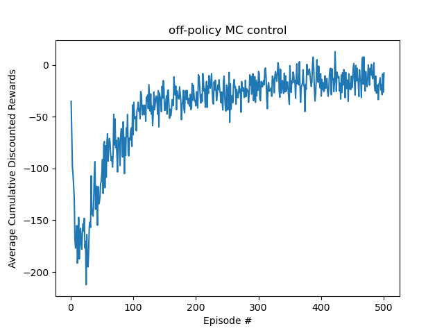
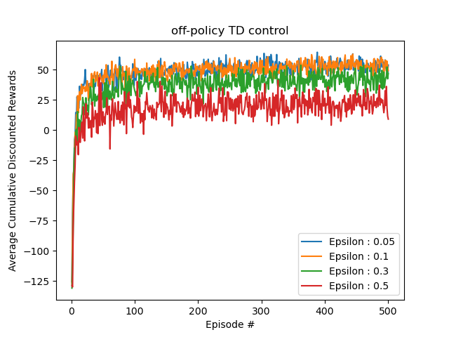

> 刘雅迪
> 计26
> 学号：2021010521

# Part 1: Dynamic Programming
## value iteration
### output:
```
Policy: [3. 3. 3. 1. 1. 3. 3. 1. 1. 1. 3. 1. 3. 3. 3. 0. 0.]
Value function: [ 52.98272805  58.65479586  71.80603574  77.09290223  46.03800916
  -5.15258579  77.83147962  84.1414826   56.78207149   1.29847647
  84.86729996  91.7816501   68.76914229  76.10763148  91.7816501
 100.           0.        ]
Number of iterations: 16
========= policy ==========
→→→↓
↓→→↓
↓↓→↓
→→→↑
========= policy ==========
```
### value iteration code:
```python
def valueIteration(self, initialV, nIterations=np.inf, tolerance=0.01): #TODO
    '''Value iteration procedure
    V <-- max_a R^a + gamma T^a V

    Inputs:
    initialV -- Initial value function: array of |S| entries
    nIterations -- limit on the # of iterations: scalar (default: infinity)
    tolerance -- threshold on ||V^n-V^n+1||_inf: scalar (default: 0.01)

    Outputs:
    policy -- Policy: array of |S| entries
    V -- Value function: array of |S| entries
    iterId -- # of iterations performed: scalar
    epsilon -- ||V^n-V^n+1||_inf: scalar'''

    # temporary values to ensure that the code compiles until this
    # function is coded
    policy = np.zeros(self.nStates)
    # V = np.zeros(self.nStates)
    V = initialV.copy()
    iterId = 0
    epsilon = float("inf")

    while iterId < nIterations and epsilon > tolerance:
        V_old = V.copy()
        for s in range(self.nStates):
            policy[s] = np.argmax([self.R[a, s] + self.discount * np.dot(self.T[a, s, :], V) for a in range(self.nActions)])
        for s in range(self.nStates):
            V[s] = max([self.R[a, s] + self.discount * np.dot(self.T[a, s, :], V) for a in range(self.nActions)])
        epsilon = np.linalg.norm(V - V_old, np.inf)
        iterId += 1

    return [policy, V, iterId, epsilon]
```
## policy iteration v1
### output
```
Policy: [3 3 3 1 1 3 3 1 1 1 3 1 3 3 3 0 0]
Value function: [ 52.98550685  58.65553358  71.8062328   77.09295576  46.0387177
  -5.15241096  77.83151901  84.14149059  56.78226127   1.29851475
  84.86730581  91.78165089  68.76919414  76.10763931  91.78165089
 100.           0.        ]
Number of iterations: 5
========= policy ==========
→→→↓
↓→→↓
↓↓→↓
→→→↑
========= policy ==========
```
### policy iteration v1
```python
def policyIteration_v1(self, initialPolicy, nIterations=np.inf, tolerance=0.01): #TODO
    '''Policy iteration procedure: alternate between policy
    evaluation (solve V^pi = R^pi + gamma T^pi V^pi) and policy
    improvement (pi <-- argmax_a R^a + gamma T^a V^pi).

    Inputs:
    initialPolicy -- Initial policy: array of |S| entries
    nIterations -- limit on # of iterations: scalar (default: inf)
    tolerance -- threshold on ||V^n-V^n+1||_inf: scalar (default: 0.01)

    Outputs:
    policy -- Policy: array of |S| entries
    V -- Value function: array of |S| entries
    iterId -- # of iterations peformed by modified policy iteration: scalar'''

    # temporary values to ensure that the code compiles until this
    # function is coded
    # policy = np.zeros(self.nStates)
    policy = initialPolicy.copy()
    V = np.zeros(self.nStates)
    iterId = 0
    policy_stable = False

    while iterId < nIterations and not policy_stable:
        # Policy Evaluation
        while True:
            V_prev = V.copy()
            A = np.zeros((self.nStates, self.nStates))
            b = np.zeros(self.nStates)
            for s in range(self.nStates):
                a = int(policy[s])  # Get the action from the policy
                A[s, s] = 1  # Coefficient for V[s]
                b[s] = self.R[a, s]  # Reward for taking action a in state s
                for s_prime in range(self.nStates):
                    A[s, s_prime] -= self.discount * self.T[a, s, s_prime]  # Subtract discounted transition contributions
            V = np.linalg.solve(A, b)

            if np.max(np.abs(V - V_prev)) < tolerance:
                break
        
        # Policy Improvement
        policy_stable = True
        for s in range(self.nStates):
            old_action = policy[s]
            policy[s] = np.argmax([self.R[a, s] + self.discount * np.sum(self.T[a, s] * V) for a in range(self.nActions)])
            if old_action != policy[s]:
                policy_stable = False
        
        iterId += 1
    
    return [policy, V, iterId]
```

## policy iteration v2
### result

|   nPolicyEvalIterations   |  Number of iterations    |
| ---- | ---- |
|   1   |   9   |
|   2   |   6   |
|   3   |   6   |
|   4   |   6   |
|   5   |   5   |
|   6   |   5   |
|   7   |   5   |
|   8   |   5   |
|   9   |   5   |
|   10   |   5   |

### discussion

| Convergence Iterations in Value Iteration | Convergence Iterations in Policy Iteration v1 | Convergence Iterations in Policy Iteration v2 |
| ---- | ---- | ---- |
|   16   |   5   |   5   |

In this maze problem, there are a total of |S| = 17 states and |A| = 4 actions. Let k denotes the number of iterations in policy evaluation(nPolicyEvalIterations). Increase k in partial policy evaluation(policy iteration v2) can reduce the number of iterations in policy iteration.
As number of Actions |A| (= 4) < number of states |S| (=17), runtime for each iteration in
- Value Iteration reduces to $O(|S|^2|A|)$
- Policy Iteration v1 reduces to $O(|S|^3)$ [As $|S| > |A|$, $|S|^3 > |S|^2|A|$ and $O(|S|^3 + |S|^2|A|)$ reduces to $O(|S|^3)$]
- Policy Iteration v2 reduces to $O(k|S|^2)$ when k > |A| (number of partial policy evaluation >= 5) and $O(|S|^2|A|)$ when k <= |A| (number of partial policy evaluation is between 1 to 4 inclusive)

For 4 < k <= 10:
$O(|S|^2|A|) < O(k|S|^2) < O(|S|^3)$
So the number of iterations in policy iteration v1 is the smallest and the number of iterations in value iteration is the largest.

For k <= 4:
$O(|S|^2|A|) < O(|S|^3)$
So the number of iterations in policy iteration v1 is the smallest.


### policy iteration v2
```python
def policyIteration_v2(self, initialPolicy, initialV, nPolicyEvalIterations=1, nIterations=np.inf, tolerance=0.01): #TODO
    '''Modified policy iteration procedure: alternate between
    partial policy evaluation (repeat a few times V^pi <-- R^pi + gamma T^pi V^pi)
    and policy improvement (pi <-- argmax_a R^a + gamma T^a V^pi)

    Inputs:
    initialPolicy -- Initial policy: array of |S| entries
    initialV -- Initial value function: array of |S| entries
    nPolicyEvalIterations -- limit on # of iterations to be performed in each partial policy evaluation: scalar (default: 5)
    nIterations -- limit on # of iterations to be performed in modified policy iteration: scalar (default: inf)
    tolerance -- threshold on ||V^n-V^n+1||_inf: scalar (default: 0.01)

    Outputs:
    policy -- Policy: array of |S| entries
    V -- Value function: array of |S| entries
    iterId -- # of iterations peformed by modified policy iteration: scalar
    epsilon -- ||V^n-V^n+1||_inf: scalar'''

    # temporary values to ensure that the code compiles until this
    # function is coded
    # policy = np.zeros(self.nStates)
    policy = initialPolicy.copy()
    # V = np.zeros(self.nStates)
    V = initialV.copy()
    iterId = 0
    epsilon = float("inf")
    policy_stable = False

    while iterId < nIterations and epsilon > tolerance:
        # partial policy evaluation
        for _ in range(nPolicyEvalIterations):
            V_old = V.copy()
            for s in range(self.nStates):
                a = policy[s]
                V[s] = self.R[a,s] + self.discount * np.sum(self.T[a,s,:] * V_old)
            epsilon = np.max(np.abs(V - V_old))
        
        # policy improvement
        policy_stable = True
        for s in range(self.nStates):
            old_action = policy[s]
            policy[s] = np.argmax([self.R[a, s] + self.discount * np.sum(self.T[a, s, :] * V) for a in range(self.nActions)])
            if old_action != policy[s]:
                policy_stable = False
    
        iterId += 1
        if policy_stable:
            break

    return [policy, V, iterId, epsilon]
```
# Part 2: Model-free Control
## off-policy MC control 
### figure

### off-policy MC control code
```python
def OffPolicyMC(self, nEpisodes, epsilon=0.0):
    '''
    Off-policy MC algorithm with epsilon-soft behavior policy
    Inputs:
    nEpisodes -- # of episodes (one episode consists of a trajectory of nSteps that starts in s0)
    epsilon -- probability with which an action is chosen at random
    Outputs:
    Q -- final Q function (|A|x|S| array)
    policy -- final policy
    '''

    # temporary values to ensure that the code compiles until this
    # function is coded
    # Q = np.zeros([self.mdp.nActions,self.mdp.nStates])
    # policy = np.zeros(self.mdp.nStates,int)

    # return [Q,policy]
    Q = np.zeros([self.mdp.nActions, self.mdp.nStates])
    C = np.zeros([self.mdp.nActions, self.mdp.nStates])
    N = np.zeros([self.mdp.nActions, self.mdp.nStates])
    policy = np.zeros(self.mdp.nStates, int)
    cumulative_rewards = np.zeros(nEpisodes)

    for episode in range(nEpisodes):
        state = np.random.randint(self.mdp.nStates)  # Start from a random state
        episode_data = []
        for step in range(100):
            if np.random.rand() < epsilon:
                action = np.random.randint(self.mdp.nActions)
            else:
                action = np.argmax(Q[:, state])

            reward, nextState = self.sampleRewardAndNextState(state, action)
            episode_data.append((state, action, reward))
            cumulative_rewards[episode] += reward * self.mdp.discount ** step
            state = nextState
        
        G = 0
        W = 1 
        for state, action, reward in reversed(episode_data):
            G = reward + G * self.mdp.discount
            C[action, state] += W
            N[action, state] += 1
            Q[action, state] += (W / N[action, state]) * (G - Q[action, state])
            if action != np.argmax(Q[:, state]):
                break 
            W *= (1 - epsilon) / (1 - (1 - epsilon) / self.mdp.nActions)

    policy = np.argmax(Q, axis=0)

    return [Q, policy]
```

## off-policy TD control
### figure


### discussion
From the figure, we can see that increasing the exploration probability epsilon reduces the cumulative rewards and also the Q-values and policy. The possible reason is that the increased exploration probability makes the agent more likely to choose a random action, which leads to a lower cumulative reward, Q-values and policy.

### off-policy TD control code
```python
def OffPolicyTD(self, nEpisodes, epsilon=0.0):
    '''
    Off-policy TD (Q-learning) algorithm
    Inputs:
    nEpisodes -- # of episodes (one episode consists of a trajectory of nSteps that starts in s0)
    epsilon -- probability with which an action is chosen at random
    Outputs:
    Q -- final Q function (|A|x|S| array)
    policy -- final policy
    '''

    # temporary values to ensure that the code compiles until this
    # function is coded
    Q = np.zeros([self.mdp.nActions,self.mdp.nStates])
    policy = np.zeros(self.mdp.nStates,int)
    n = np.zeros((self.mdp.nActions, self.mdp.nStates))
    cumulative_rewards = np.zeros(nEpisodes)

    for episode in range(nEpisodes):
        state = np.random.randint(self.mdp.nStates)  # Start from a random state
        for step in range(100):
            if np.random.rand() < epsilon:
                action = np.random.randint(self.mdp.nActions)
            else:
                action = np.argmax(Q[:, state])
            
            reward, nextState = self.sampleRewardAndNextState(state, action)
            cumulative_rewards[episode] += reward * self.mdp.discount ** step
            n[action][state] += 1
            alpha = 1.0 / n[action][state]
            Q[action, state] += alpha * (reward + self.mdp.discount * np.max(Q[:, nextState]) - Q[action, state])

            state = nextState

    policy = np.argmax(Q, axis=0)

    return [Q,policy]
```