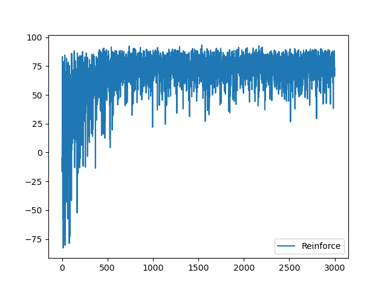
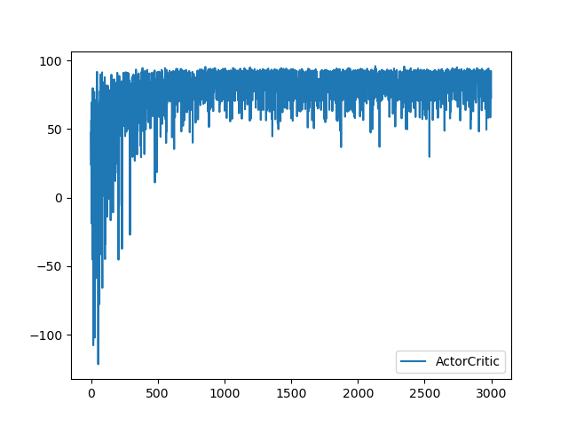
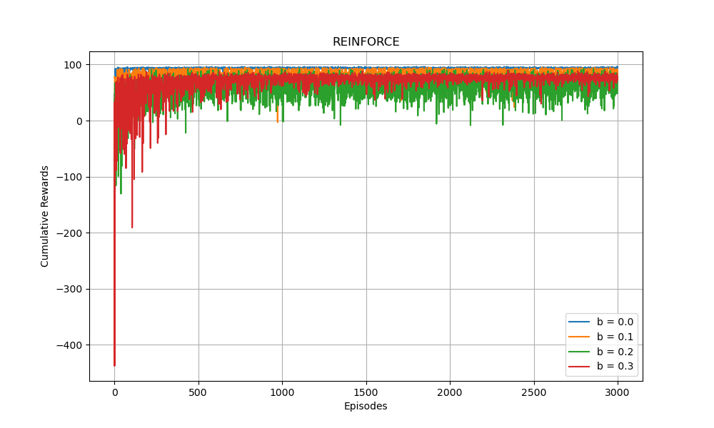

> 刘雅迪
> 计26
> 学号：2021010521

# Part 1: Implementing policy gradient algorithms
## Implementation
### REINFORCE
1.参数化策略
在REINFORCE中，策略通过参数$\theta$定义，表示在状态s下采取动作a的概率分布。$\theta$是一个$nActions × nStates$的向量，$\phi(s,a)$是$nActions × nStates$维线性空间下的标准正交基：
$$\pi_{\theta}(a|s) = \frac{exp(\theta_{a,s})}{\sum_{a'} exp(\theta_{a',s})}$$

根据课件上softmax policy的gradient算法：
$$∇_{\theta}log\pi(a|s) = \phi(s, a)-E_{a\sim \pi}[\phi(s,a)]$$

2.生成轨迹
对于每个 episode：
* 从初始状态$s_0$开始。
* 根据当前策略$\pi_{\theta}$选择动作$a_t$​，执行动作后进入下一个状态$s_{t+1}$​，并获得即时奖励$r_t$​。
* 累计计算折扣奖励

3.策略梯度更新
$$G_t \leftarrow \sum_{k=t+1}^T \gamma^{k-t-1}r_k$$

$$\theta \leftarrow \theta + \alpha \gamma^t G ∇_{\theta}ln\pi_{\theta}(a_t|s_t) $$


### Actor-Critic
1.参数化策略（Parameterized Policy）
和上述REINFORCE相同，策略通过参数$\theta$定义，表示在状态s下采取动作a的概率分布。$\theta$是一个$nActions × nStates$的向量，$\phi(s,a)$是$nActions × nStates$维线性空间下的标准正交基：
$$\pi_{\theta}(a|s) = \frac{exp(\theta_{a,s})}{\sum_{a'} exp(\theta_{a',s})}$$

根据课件上softmax policy的gradient算法：
$$∇_{\theta}log\pi(a|s) = \phi(s, a)-E_{a\sim \pi}[\phi(s,a)]$$

2.更新规则
时间差分（TD）误差：
$$\delta_t \leftarrow r_t + \gamma V_w(s_{t+1}) - V_w(s_t)$$
Critic更新：
$$w \leftarrow w + \beta \delta ∇V(s,w) $$
Actor更新：
$$\theta \leftarrow \theta + \alpha I_t \delta ∇_{\theta}ln\pi_{\theta}(a_t|s_t) $$

3.算法步骤
* 初始化策略参数$\theta$和值函数参数$w$。
* 对于每个episode：
  * 从初始状态$s_0$开始，设置积累因子I=0
  * 生成轨迹：在每一步中，
    * 按照策略选择动作
    * 执行动作，观察即时奖励$r_t$和下一个状态$s_{t+1}$​。
    * 计算TD误差$\delta_t$
    * 更新Critic参数$w$和Actor参数$\theta$
    * 累积折扣奖励


## Evaluation
n_episode = 1000
n_trials = 10
### REINFORCE


#### Code
```python
    def reinforce(self, theta, alpha=0.001, nEpisodes=3000):
        n_actions, n_states = self.mdp.R.shape
        if theta is None:
            theta = np.random.rand(n_states, n_actions)

        cum_rewards = np.zeros(nEpisodes)

        for episode in range(nEpisodes):
            state = 0
            trajectory = []
            done = False

            while not done:
                probs = self.policy(theta, state)
                action = np.random.choice(range(n_actions), p=probs)
                reward, next_state = self.sampleRewardAndNextState(state, action)
                trajectory.append((state, action, reward))
                cum_rewards[episode] += reward
                state = next_state

                if state == self.mdp.nStates - 1:
                    done = True

            for t, (s, a, r) in enumerate(trajectory):
                G_t = sum([(self.mdp.discount ** k) * reward for k, (_, _, reward) in enumerate(trajectory[t:])])
                probs = self.policy(theta, s)
                grad_log_pi = -probs
                grad_log_pi[a] += 1
                theta[:, s] += alpha * (self.mdp.discount ** t) * G_t * grad_log_pi

        return cum_rewards, theta
```

### Actor-Critic


#### Code
```python
    def actorCritic(self, theta, alpha=0.001, beta=0.01, nEpisodes=3000):
        n_actions, n_states = self.mdp.R.shape
        if theta is None:
            theta = np.random.rand(n_states, n_actions)
        w = np.zeros(n_states) 

        cum_rewards = np.zeros(nEpisodes)

        for episode in range(nEpisodes):
            state = 0
            I = 1
            done = False

            while not done:
                probs = self.policy(theta, state)
                action = np.random.choice(range(n_actions), p=probs)
                reward, next_state = self.sampleRewardAndNextState(state, action)

                td_error = reward + self.mdp.discount * w[next_state] - w[state]
                w[state] += beta * td_error
                grad_log_pi = -probs
                grad_log_pi[action] += 1
                theta[:, state] += alpha * I * td_error * grad_log_pi

                cum_rewards[episode] += reward
                I = self.mdp.discount * I
                state = next_state

                if state == self.mdp.nStates - 1:
                    done = True
                      

        return cum_rewards, theta
```

# Part 2: Fine-tuning and Comparison
## learning rate tuning
### REINFORCE
$\alpha=0.0001$：
大概在episode达到2000时收敛


$\alpha=0.0003$：
大概在episode达到1300时收敛


$\alpha=0.0005$：
大概在episode达到900时收敛


$\alpha=0.0007$：
大概在episode达到500时收敛


$\alpha=0.001$：
大概在episode达到300时收敛


$\alpha=0.003$：
大概在episode达到250时收敛


由上述可知在一定范围内$\alpha$越大，收敛得越快。推荐选择$\alpha$为0.001或0.0007，收敛速度较快，且较为稳定。

### Actor-Critic
由一般的经验可知，Critic 的学习率一般比 Actor 大一到两个数量级，因为 Critic 的更新需要更快速跟踪状态值估计。
$\alpha=0.001, \beta=0.01$：
大概在episode达到800时收敛


$\alpha=0.001, \beta=0.001$:
大概在episode达到1200时收敛


$\alpha=0.001, \beta=0.005$:
大概在episode达到1000时收敛


$\alpha=0.0001, \beta=0.01$:
大概在episode达到1700时收敛


$\alpha=0.0001, \beta=0.001$:
大概在episode达到3000时收敛


$\alpha=0.0005, \beta=0.01$:
大概在episode达到1100时收敛


$\alpha=0.0005, \beta=0.001$:
大概在episode达到1700时收敛


$\alpha=0.0005, \beta=0.005$:
大概在episode达到1300时收敛


由上述可知当$\alpha=0.001, \beta=0.01$时曲线收敛较快。

### affects
经过上述分析，学习率较小时曲线收敛速度较慢，但最后仍然可能收敛到全局最优。学习率较大时曲线收敛速度较快，但过大的学习率可能导致曲线剧烈波动，甚至不收敛。所以选择适合的学习率有利于算法的收敛速度和稳定性。

## changing environment
### REINFORCE


### Actor-Critic


### the impact of b
由上述图片可以看出，当b=0时，环境是确定性的，动作完全决定状态的转移，智能体可以稳定地利用学到的策略，所以训练期间累计奖励增长较快。而当b较大时，训练期间累计奖励增长更慢，且可能表现出较高的波动性。

## comparison between value-based and policy-based algorithms
取b=0.0, 0.1, 0.2, 0.3, REINFORCE算法中的alpha取0.001, Actor-Critic算法中的alpha取0.001, beta取0.01, off-policy MC和Q-learning的epsilon均取0.1
b=0.0:


b=0.1:


b=0.2:


b=0.3:


由上述图片可以看出：
当b较小时（低随机性）：
Q-learning 和 Actor-Critic 表现最佳。因为环境更可预测，这两种算法可以较快地收敛到最优策略。
REINFORCE 和 Off-policy MC 方法可能因为梯度估计或采样方差的问题而略显不足。

当b较大时（高随机性）：
Actor-Critic 表现最好，因为它的双模块设计可以适应高随机性。
Q-learning 表现略有下降，主要是因为随机性的增加增大了Q(s,a)值的波动，可能当b值更大时表现得更明显。
REINFORCE 的性能显著下降，因为高随机性会进一步放大梯度估计的方差。
Off-policy MC 方法几乎无法有效收敛，重要性采样的方差问题显著。
